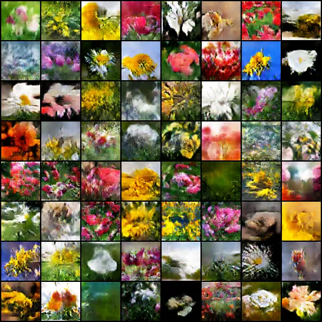

# Flower DCGAN

A simple DCGAN (Deep Convolutional Generative Adversarial Network) that generates flower images, trained on the [Flowers Recognition](https://www.kaggle.com/datasets/alxmamaev/flowers-recognition) dataset from Kaggle. Built with PyTorch and designed to run on a free Google Colab T4 GPU.

## Sample output

After 150 epochs of training, the generator produces recognizable flowers with distinct colors, petal shapes, and backgrounds:



## How it works

The model is a standard DCGAN:

- **Generator**: takes a 100-dimensional random noise vector and upsamples it through 5 transposed convolution layers into a 64x64 RGB image.
- **Discriminator**: a convolutional classifier that tries to distinguish real flower images from generated ones.

Both networks are trained together — the generator tries to fool the discriminator, the discriminator tries not to be fooled. Over many epochs the generator learns to produce increasingly realistic flower images.

## Requirements

See `requirements.txt`. Main dependencies:

- Python 3.9+
- PyTorch (with CUDA support)
- torchvision
- kagglehub
- Pillow

## Usage

### Google Colab (recommended)

1. Open a new Colab notebook.
2. Go to **Runtime > Change runtime type** and select **T4 GPU**.
3. Copy the contents of `dcgan_flowers.py` into a cell and run it.
4. The dataset is downloaded automatically via `kagglehub` on first run — you may be prompted to log in with a Kaggle account/API token.

### Locally

```bash
pip install -r requirements.txt
python dcgan_flowers.py
```

A CUDA-capable GPU is strongly recommended. On CPU this will be very slow.

## Output

- Generated sample grids are saved every epoch to the `samples/` folder as `epoch_N.png`.
- Each grid contains 64 generated images produced from the same fixed noise vector, so you can visually track progress across epochs.

## Configuration

Key parameters at the top of the script:

| Parameter | Default | Description |
|---|---|---|
| `image_size` | 64 | Output image resolution (square) |
| `batch_size` | 128 | Training batch size |
| `nz` | 100 | Size of the generator's input noise vector |
| `num_epochs` | 150 | Number of training epochs |

## Notes

- Training for more epochs generally improves image quality, with diminishing returns after 100-150 epochs on this dataset.
- The classic `ConvTranspose2d`-based generator can produce mild "checkerboard" artifacts. This can be reduced by switching to `Upsample` + `Conv2d` blocks in the generator, at the cost of higher memory use and longer training time.
- If you hit a `CUDA out of memory` error, lower `batch_size` or `image_size`.

## Dataset

This project uses the [Flowers Recognition dataset](https://www.kaggle.com/datasets/alxmamaev/flowers-recognition) by Alexander Mamaev on Kaggle, containing ~4,300 images across 5 flower categories (daisy, dandelion, rose, sunflower, tulip). The dataset is downloaded automatically via `kagglehub` and is not included in this repository. Refer to the Kaggle page for its license and terms of use.

## License

This project's code is licensed under the MIT License — see [LICENSE](LICENSE) for details. The dataset used has its own separate license on Kaggle and is not covered by this repository's license.
